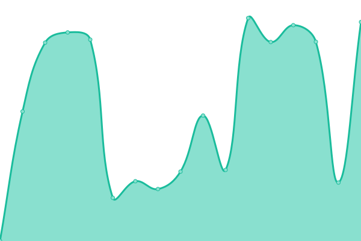
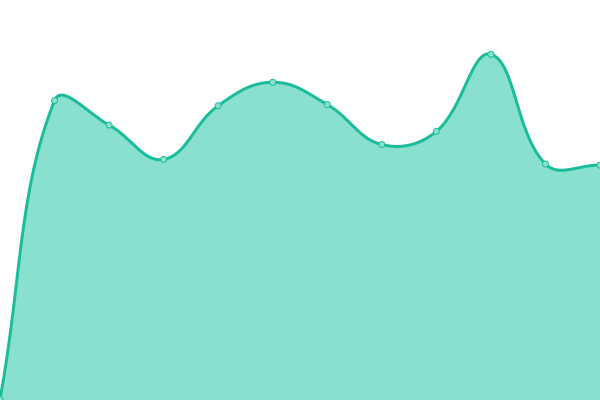

# [📈 Live Status](https://status.hidessh.com): <!--live status--> **🟧 Partial outage**

This repository contains the open-source uptime monitor and status page for [Dedi Susanto](sshcdn.com), powered by [Upptime](https://github.com/upptime/upptime).

With [Upptime](https://upptime.js.org), you can get your own unlimited and free uptime monitor and status page, powered entirely by a GitHub repository. We use [Issues](https://github.com/4rukadi/hidessh-web/issues) as incident reports, [Actions](https://github.com/4rukadi/hidessh-web/actions) as uptime monitors, and [Pages](https://status.hidessh.com) for the status page.

<!--start: status pages-->
<!-- This summary is generated by Upptime (https://github.com/upptime/upptime) -->
<!-- Do not edit this manually, your changes will be overwritten -->
<!-- prettier-ignore -->
| URL | Status | History | Response Time | Uptime |
| --- | ------ | ------- | ------------- | ------ |
|  [SSH Singapore 1](http://sg1.hidesvr.xyz:3128) | 🟥 Down | [ssh-singapore-1.yml](https://github.com/hidessh99/up-ssh/commits/HEAD/history/ssh-singapore-1.yml) | 

 0ms
     
 | 

<a href="https://ssh.hidessh.com/history/ssh-singapore-1">0.00%</a>
    

|  [SSH Singapore 2](http://sg2.hidesvr.xyz:3128) | 🟥 Down | [ssh-singapore-2.yml](https://github.com/hidessh99/up-ssh/commits/HEAD/history/ssh-singapore-2.yml) | 

 0ms
     
 | 

<a href="https://ssh.hidessh.com/history/ssh-singapore-2">0.00%</a>
    

|  [SSH Singapore 3](http://sg3.hidesvr.xyz:3128) | 🟥 Down | [ssh-singapore-3.yml](https://github.com/hidessh99/up-ssh/commits/HEAD/history/ssh-singapore-3.yml) | 

 0ms
     
 | 

<a href="https://ssh.hidessh.com/history/ssh-singapore-3">0.00%</a>
    

|  [SSH Singapore 4](http://sg4.hidesvr.xyz:3128) | 🟥 Down | [ssh-singapore-4.yml](https://github.com/hidessh99/up-ssh/commits/HEAD/history/ssh-singapore-4.yml) | 

 0ms
     
 | 

<a href="https://ssh.hidessh.com/history/ssh-singapore-4">0.00%</a>
    

|  [SSH Malaysia 1](http://my.hidesvr.xyz:81) | 🟥 Down | [ssh-malaysia-1.yml](https://github.com/hidessh99/up-ssh/commits/HEAD/history/ssh-malaysia-1.yml) | 

 0ms
     
 | 

<a href="https://ssh.hidessh.com/history/ssh-malaysia-1">0.00%</a>
    

|  [SSH Malaysia 1](http://my2.hidesvr.xyz:81) | 🟥 Down | [ssh-malaysia-1.yml](https://github.com/hidessh99/up-ssh/commits/HEAD/history/ssh-malaysia-1.yml) | 

 0ms
     
 | 

<a href="https://ssh.hidessh.com/history/ssh-malaysia-1">0.00%</a>
    

|  [SSH Indonesia 1](http://id.hidesvr.xyz:3128) | 🟥 Down | [ssh-indonesia-1.yml](https://github.com/hidessh99/up-ssh/commits/HEAD/history/ssh-indonesia-1.yml) | 

 0ms
     
 | 

<a href="https://ssh.hidessh.com/history/ssh-indonesia-1">0.00%</a>
    

|  [SSH Indonesia 2](http://id2.hidesvr.xyz:3128) | 🟥 Down | [ssh-indonesia-2.yml](https://github.com/hidessh99/up-ssh/commits/HEAD/history/ssh-indonesia-2.yml) | 

 0ms
     
 | 

<a href="https://ssh.hidessh.com/history/ssh-indonesia-2">0.00%</a>
    

|  [SSH Indonesia 3](http://id3.hidesvr.xyz:3128) | 🟥 Down | [ssh-indonesia-3.yml](https://github.com/hidessh99/up-ssh/commits/HEAD/history/ssh-indonesia-3.yml) | 

 0ms
     
 | 

<a href="https://ssh.hidessh.com/history/ssh-indonesia-3">0.00%</a>
    

|  [SSH Singapore 5](http://sg5.hidesvr.xyz:3128) | 🟥 Down | [ssh-singapore-5.yml](https://github.com/hidessh99/up-ssh/commits/HEAD/history/ssh-singapore-5.yml) | 

 0ms
     
 | 

<a href="https://ssh.hidessh.com/history/ssh-singapore-5">0.00%</a>
    

|  [SSH India](http://in.hidesvr.xyz:3128) | 🟥 Down | [ssh-india.yml](https://github.com/hidessh99/up-ssh/commits/HEAD/history/ssh-india.yml) | 

 0ms
     
 | 

<a href="https://ssh.hidessh.com/history/ssh-india">0.00%</a>
    

|  [SSH Australia](http://au.hidesvr.xyz:3128) | 🟥 Down | [ssh-australia.yml](https://github.com/hidessh99/up-ssh/commits/HEAD/history/ssh-australia.yml) | 

 0ms
     
 | 

<a href="https://ssh.hidessh.com/history/ssh-australia">0.00%</a>
    

|  [SSH Canada](http://ca.hidesvr.xyz:3128) | 🟥 Down | [ssh-canada.yml](https://github.com/hidessh99/up-ssh/commits/HEAD/history/ssh-canada.yml) | 

 0ms
     
 | 

<a href="https://ssh.hidessh.com/history/ssh-canada">0.00%</a>
    

|  [SSH us](http://us.hidesvr.xyz:3128) | 🟥 Down | [ssh-us.yml](https://github.com/hidessh99/up-ssh/commits/HEAD/history/ssh-us.yml) | 

 0ms
     
 | 

<a href="https://ssh.hidessh.com/history/ssh-us">0.00%</a>
    

|  [NGINX](https://web.sshcdn.com) | 🟩 Up | [nginx.yml](https://github.com/hidessh99/up-ssh/commits/HEAD/history/nginx.yml) | 

 420ms
     
 | 

<a href="https://ssh.hidessh.com/history/nginx">100.00%</a>
    

<!--end: status pages-->

[**Visit our status website →**](https://status.hidessh.com)

## 📄 License

- Powered by: [Upptime](https://github.com/upptime/upptime)
- Code: [MIT](./LICENSE) © [Dedi Susanto](sshcdn.com)
- Data in the `./history` directory: [Open Database License](https://opendatacommons.org/licenses/odbl/1-0/)
