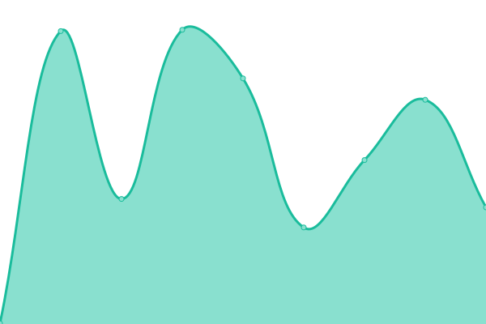

# [📈 Live Status](https://status.hidessh.com): <!--live status--> **🟩 All systems operational**

This repository contains the open-source uptime monitor and status page for [Dedi Susanto](sshcdn.com), powered by [Upptime](https://github.com/upptime/upptime).

With [Upptime](https://upptime.js.org), you can get your own unlimited and free uptime monitor and status page, powered entirely by a GitHub repository. We use [Issues](https://github.com/4rukadi/hidessh-web/issues) as incident reports, [Actions](https://github.com/4rukadi/hidessh-web/actions) as uptime monitors, and [Pages](https://status.hidessh.com) for the status page.

<!--start: status pages-->
<!-- This summary is generated by Upptime (https://github.com/upptime/upptime) -->
<!-- Do not edit this manually, your changes will be overwritten -->
<!-- prettier-ignore -->
| URL | Status | History | Response Time | Uptime |
| --- | ------ | ------- | ------------- | ------ |
|  [HideSSH Website](https://hidessh.com/) | 🟩 Up | [hide-ssh-website.yml](https://github.com/4rukadi/hidessh-web/commits/HEAD/history/hide-ssh-website.yml) | 

 2081ms
     
 | 

<a href="https://ping.hidessh.com/history/hide-ssh-website">100.00%</a>
    

|  [Blog HideSSH](https://hidessh.com/blog) | 🟩 Up | [blog-hide-ssh.yml](https://github.com/4rukadi/hidessh-web/commits/HEAD/history/blog-hide-ssh.yml) | 

 879ms
     
 | 

<a href="https://ping.hidessh.com/history/blog-hide-ssh">100.00%</a>
    

|  [PPOB](https://ppob.hidessh.com) | 🟩 Up | [ppob.yml](https://github.com/4rukadi/hidessh-web/commits/HEAD/history/ppob.yml) | 

 2438ms
     
 | 

<a href="https://ping.hidessh.com/history/ppob">100.00%</a>
    

|  [Shorlink](https://s.hidessh.com) | 🟩 Up | [shorlink.yml](https://github.com/4rukadi/hidessh-web/commits/HEAD/history/shorlink.yml) | 

 1203ms
     
 | 

<a href="https://ping.hidessh.com/history/shorlink">100.00%</a>
    

|  [IP Address](https://ip.hidessh.com) | 🟩 Up | [ip-address.yml](https://github.com/4rukadi/hidessh-web/commits/HEAD/history/ip-address.yml) | 

 1616ms
     
 | 

<a href="https://ping.hidessh.com/history/ip-address">100.00%</a>
    

|  [Kasir](https://pos.hidessh.com) | 🟩 Up | [kasir.yml](https://github.com/4rukadi/hidessh-web/commits/HEAD/history/kasir.yml) | 

 1242ms
     
 | 

<a href="https://ping.hidessh.com/history/kasir">100.00%</a>
    

|  [Panel HideSSH](https://panel.hidessh.com) | 🟩 Up | [panel-hide-ssh.yml](https://github.com/4rukadi/hidessh-web/commits/HEAD/history/panel-hide-ssh.yml) | 

 1180ms
     
 | 

<a href="https://ping.hidessh.com/history/panel-hide-ssh">100.00%</a>
    

|  [NGINX](https://web.sshcdn.com) | 🟩 Up | [nginx.yml](https://github.com/4rukadi/hidessh-web/commits/HEAD/history/nginx.yml) | 

 1239ms
     
 | 

<a href="https://ping.hidessh.com/history/nginx">100.00%</a>
    

<!--end: status pages-->

[**Visit our status website →**](https://status.hidessh.com)

## 📄 License

- Powered by: [Upptime](https://github.com/upptime/upptime)
- Code: [MIT](./LICENSE) © [Dedi Susanto](sshcdn.com)
- Data in the `./history` directory: [Open Database License](https://opendatacommons.org/licenses/odbl/1-0/)
